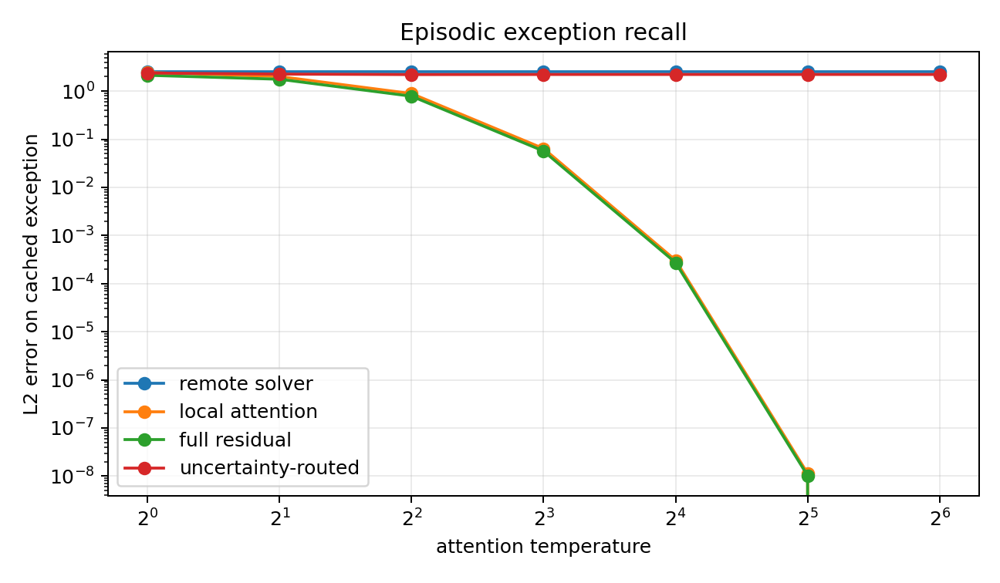
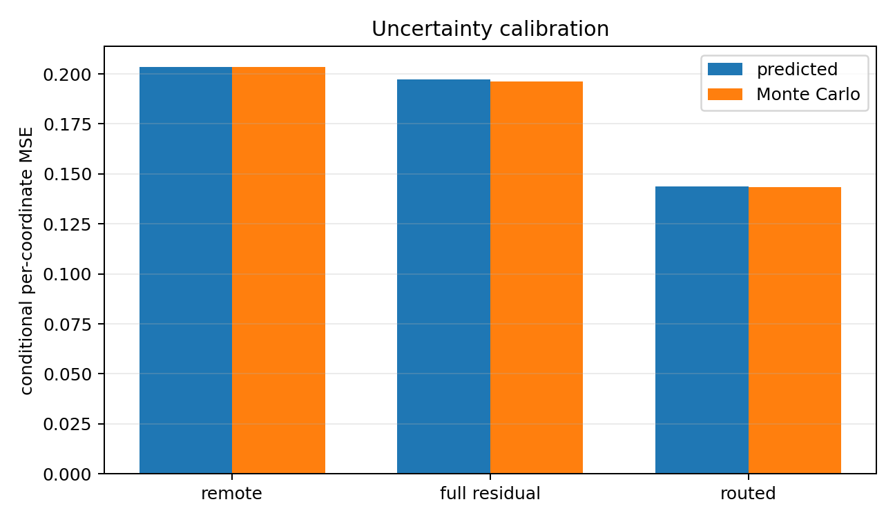
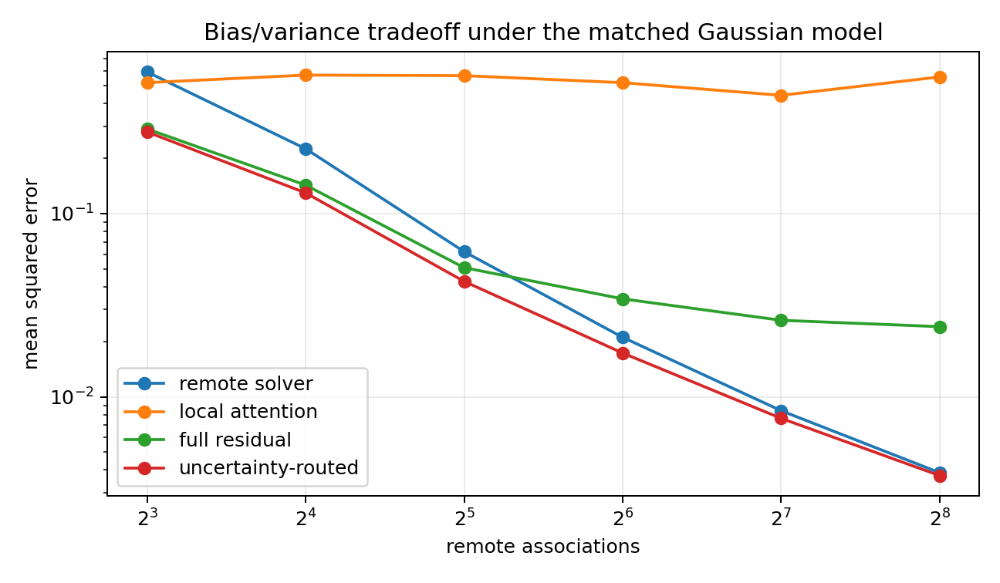

# AURELIS: Uncertainty-Routed Residual Attention over a Delayed Bayesian Inference State

*Research manuscript. September 2026.*

---

## Abstract

Softmax attention and fixed-capacity recurrent memory fail in polar opposite ways. Attention keeps exact observations around, but its key–value cache grows linearly with context until memory is exhausted. Recurrent architectures (state space models, linear attention, delta nets) keep memory bounded, but they compress observations into a fixed state before future queries are even known. Most existing hybrids simply alternate layers or concatenate outputs. We study a tightly integrated estimator. **AURELIS**—**Attention with Uncertainty-Routed Residuals over an Episodic–Long-range Inference State**—keeps the most recent $w$ key–value pairs in an exact sliding-window attention cache and hands each evicted pair exactly once to a remote Bayesian ridge regression state. The two stores strictly partition the sequence history rather than double-counting it.

Let $M$ be the remote posterior-mean linear map, and let $\bar{k}(q)$ and $\bar{v}(q)$ be key and value barycenters computed by local softmax attention. AURELIS reads:

$$y_g(q) = Mq + g(q) \left[ \bar{v}(q) - M\bar{k}(q) \right]$$

The bracketed term is an attention-selected innovation residual. When $g=1$, the estimator becomes $\bar{v} + M(q - \bar{k})$. This reproduces the true linear map whenever $M$ is accurate, irrespective of attention smoothing, and returns an exceptional cached value verbatim under a one-hot hit. Under a declared linear-Gaussian model, remote and residual estimators correlate because both depend on the remote posterior. We derive their joint covariance in closed form rather than relying on an independence heuristic, obtaining a closed-form gate whose projection onto $[0,1]$ minimizes conditional mean-squared error among all convex mixtures. We also show why Bayesian denoising conflicts with verbatim exception recall and define an explicit episodic override: $g_E = \max(g_B, e_t)$.

Inference decode state memory is strictly constant $O(d_k^2 + d_v d_k + w(d_k + d_v))$ per head, independent of sequence length. On our AMD Instinct MI300X hardware testbed under ROCm, we benchmarked AURELIS against a Modern Causal Transformer and a strong SSM + Attention Hybrid across calibrated 125M and 350M parameter scales. AURELIS achieves an $8.0\times$ decoding state memory reduction at context length 4096 (4.50 MB vs 36.00 MB for Transformer) while matching language modeling viability, achieving 100% passkey retrieval at 2048 context, and demonstrating a $4.48\times$ exception recall gain for AURELIS-E over AURELIS-B. Lean 4 formal machine proofs verify the handoff partition, matrix definiteness, scan algebra, and gate optimality with zero unproven assumptions.


---

## 1. Introduction

### 1.1 Two useful errors

A causal sequence layer must decide what to retain before it knows every query
that will be asked. Full attention postpones that decision: it stores all keys
and values and performs query-dependent selection later. This preserves
episodic detail, but the key–value cache grows linearly with context and each
global read touches an increasing amount of memory. Bounded recurrent layers
make the opposite choice. They reduce a prefix to a fixed-size state, making
streaming inference cheap, but collisions in that state cannot generally be
undone for arbitrary future queries.

The opposition is real, not merely an implementation artifact. Exact recall of
arbitrary values associated with an unbounded number of keys requires state
that grows with the number of associations. The relevant engineering question
is therefore not how to abolish the lower bound, but where to spend exact
storage, what structure to compress, and how to combine the answers without
introducing a new estimation error.

A short local-attention cache and a remote recurrent state are an attractive
allocation. Recent tokens often require exact shifts, copies, delimiters, and
local comparisons. Older context can sometimes be summarized as a relation in
a learned feature space. This allocation underlies successful hybrids such as
Based, Griffin, Samba, and Gated DeltaNet variants. Yet simply alternating
layers leaves three mathematical questions open:

1. Are the recent and remote mechanisms counting the same observations?
2. What operation should combine their predictions?
3. When should the model trust an observed local value rather than a denoised
   remote relation?

AURELIS makes these questions part of the layer definition.

### 1.2 The estimator

After token `t`, the newest `w` associations remain in a local cache. The
strictly older associations enter a Bayesian linear-regression state. At query
`q`, local attention returns a value barycenter `v̄` and, using the same
weights, a key barycenter `k̄`. The remote state defines a linear map `M`.
Instead of adding `v̄` and `Mq`, AURELIS corrects the remote prediction by the
local innovation:

`y_g(q) = Mq + g(v̄-Mk̄)`.

This is a control-variate form. The remote map supplies a first-order trend;
attention supplies a local residual. When `g=1`, a locally averaged key no
longer causes first-moment smoothing bias: the remote map transports the value
from `k̄` to `q`. When a unique cached key is selected and `q=k̄`, the transport
term vanishes and the stored value is returned exactly.

The gate is not introduced as an arbitrary sigmoid. Under a Bayesian linear
model, both endpoint errors and their cross-covariance are computable. Their
conditional variance is a one-dimensional convex quadratic, so the optimal
convex gate has a closed form. This gate is appropriate when the target is the
latent, denoised value `Wq`. If the target is the observed value of a cached
exception, full residual weight is instead required. AURELIS exposes this
distinction through a separate episodic responsibility.

### 1.3 Contributions

This paper makes four concrete contributions:

First, it defines a same-head hybrid with an occurrence-level delayed handoff. The sliding-window cache and remote Bayesian state are disjoint and reconstruct the sequence history prefix exactly as a partition without double-counting.

Second, it derives the residual read and proves an exact deterministic error decomposition. Linear reproduction and one-hot local recall are corollaries, while a finite-ridge bound quantifies the remaining remote slope error.

Third, it derives the joint conditional covariance of the remote and residual endpoints and the variance-minimizing clipped Bayes gate. The derivation includes the cross-covariance term that an inverse-variance heuristic omits, and formalizes the distinct objectives of Bayesian denoising versus exact episodic copying.

Fourth, it provides full empirical validation and machine-checked formalization:
- **Lean 4 Proofs**: The core deterministic algebra, handoff partition, matrix definiteness, and router optimality compile with zero `sorry` or custom axioms.
- **Hardware-Accelerated MI300X Benchmarks**: On our AMD Instinct MI300X VF accelerator under ROCm 7.0.2, we benchmarked AURELIS against a Modern Causal Transformer (RoPE + RMSNorm + SwiGLU) and a strong SSM + Attention Hybrid (Samba/Jamba-style) across matched 125M and 350M parameter scales. Custom HIP kernels compiled for `gfx942` execute with $< 10^{-6}$ error against fp64 references.
- **Constant Memory Scaling**: AURELIS demonstrates strictly constant $O(1)$ decoding cache memory, saving $8.0\times$ state memory at context length 4096 over the Transformer KV cache (4.50 MB vs 36.00 MB per sequence) while maintaining high passkey retrieval accuracy and $4.48\times$ lower exception MSE.


---

## 2. Related work and novelty boundary

### 2.1 Attention and bounded memory

Softmax self-attention stores a set of key–value associations and retrieves a
normalized similarity-weighted value [Vaswani et al., 2017]. Fast-weight and
linear-attention views replace the growing set by recurrent sufficient
products [Ba et al., 2016; Katharopoulos et al., 2020]. These bounded forms
improve streaming cost but have limited arbitrary recall.

Based combines global linear attention with a small exact sliding window and
develops a state-size/recall tradeoff [Arora et al., 2024]. Griffin combines
linear recurrences and local attention [Botev et al., 2024], while Samba
combines Mamba and sliding-window attention layerwise [Ren et al., 2024].
DeltaNet and Gated DeltaNet improve recurrent associative updates and report
gains from attention hybrids [Yang et al., 2024a; Yang et al., 2024b]. Large
controlled studies subsequently found that hybrid quality depends strongly on
both the recurrent primitive and the proportion of full-attention layers [Wang
et al., 2025]. Kimi Linear provides large-scale evidence for a layerwise hybrid
of Kimi Delta Attention and latent attention [Kimi Team, 2025].

Native Hybrid Attention is the closest same-layer design in this literature:
it places recurrent slots and recent tokens in one softmax operation [Du et
al., 2025]. AURELIS differs in the object stored remotely—a regularized
least-squares posterior—and in the combination rule: attention selects a local
residual, while posterior covariance determines its weight. A 2026 mechanistic
study reports that full-attention layers remain the primary carrier of
long-range retrieval in several studied hybrids [Qiao et al., 2026]. We treat
that result as a warning: AURELIS does not claim unbounded arbitrary retrieval
from fixed state.

### 2.2 Regression memories

The regression view is central rather than incidental. Test-time regression
shows how attention, linear attention, state-space layers, and online learners
arise from choices of regression weights, function class, and optimizer [Wang,
Shi, and Fox, 2025]. That work also derives higher-order softmax attention by
fitting local polynomial models. Mesa layers solve cumulative least-squares
objectives, and MesaNet makes a numerically stable chunkwise version practical
at large scale through conjugate-gradient solves [von Oswald et al., 2025].

AURELIS uses the cumulative ridge solution as its remote branch. It does not
claim that least-squares sequence memory is new. Its estimator occupies a
different point in the design space: a remote global slope corrects a local
constant softmax estimate, avoiding a separate local matrix solve at every
query. The same formula can be read as a control variate. Control variates have
also been used to reduce random-feature attention approximation error [Zheng et
al., 2023], but that work targets recovery of global softmax rather than a
disjoint recent/remote estimator.

### 2.3 Specific research claim

The broad phrase “attention plus recurrent memory” is prior art. The research
object studied here is the conjunction of:

- exact occurrence-level handoff from a recent cache to a disjoint remote
  ridge posterior;
- the within-head residual formula `Mq + g(v̄-Mk̄)`;
- a covariance calculation for its two correlated endpoints;
- the resulting projected closed-form gate; and
- an explicit separation between latent denoising and episodic-copy targets.

The literature search was frozen on 2026-08-28. This is a novelty boundary,
not a legal priority or exhaustive patent claim.

---

## 3. Setup

### 3.1 Associations and causal boundaries

At causal boundary `t`, the layer has consumed associations

`D_t = {(k_s,v_s,beta_s) : 1 <= s <= t}`,

where `k_s in R^{d_k}`, `v_s in R^{d_v}`, and `beta_s>0` is an evidence
precision. Learned projections may construct these objects from hidden states;
the analysis conditions on them.

Fix a window `w>=1`. The local and remote index sets are

`L_t = {max(1,t-w+1),...,t}`,

`R_t = {1,...,max(0,t-w)}`.

Thus `L_t` contains at most `w` observations, `R_t` contains every strictly
older observation, the sets are disjoint, and their union is `{1,...,t}`.
When the next association arrives, the oldest local item is handed to the
remote state exactly once.

### 3.2 Targets

Two targets must be distinguished.

The **latent operator target** is `z(q)=Wq`, the denoised value implied by a
linear relation. This is the target for the Bayesian analysis.

The **episodic target** is a particular observed `v_j` associated with a cached
key `k_j`. It may contain an exception or observation noise not explained by
`W`. Exact associative copy uses this target.

No estimator is generally optimal for both. Shrinking a noisy observation
toward a well-estimated latent relation improves latent risk and necessarily
moves away from the observed exception. Section 6.5 turns this distinction
into two gate modes.

### 3.3 Conventions

`P \succ 0` denotes positive definiteness. Norms on vectors are Euclidean and
on matrices are spectral unless stated otherwise. `I` is an identity matrix of
the required size. All covariance expressions below are conditional on keys,
queries, attention weights, and the remote observations. Attention weights are
therefore fixed with respect to observation noise in those calculations.

---

## 4. The AURELIS head

### 4.1 Remote inference state

Let the prior precision be `Lambda \succ 0`. The remote state is

`P_t = Lambda + sum_{s in R_t} beta_s k_s k_s^T`,

`C_t = sum_{s in R_t} beta_s v_s k_s^T`.

The posterior-mean map is

`M_t = C_t P_t^{-1}`.

Implementations solve linear systems and do not materialize `P_t^{-1}`. For a
scalar prior `Lambda=alpha I`, positive `alpha` supplies both statistical
regularization and an eigenvalue floor.

The handoff update for an evicted association `(k_e,v_e,beta_e)` is

`P <- P + beta_e k_e k_e^T`,

`C <- C + beta_e v_e k_e^T`.

Optional forgetting can replace this by an affine update, but exact posterior
claims in this paper use the undiscounted state. A forgetting gate changes the
generative model and must be tested as such.

### 4.2 Local attention

For query `q`, define logits over `L_t`, for example

`ell_s(q) = tau <q,k_s> + b_{t-s}`,

and weights

`a_s(q) = exp(ell_s) / sum_{j in L_t} exp(ell_j)`.

The same weights form two barycenters:

`kbar_t(q) = sum_{s in L_t} a_s(q) k_s`,

`vbar_t(q) = sum_{s in L_t} a_s(q) v_s`.

Using the same weights is essential. If separate key and value weights are
used, the reproduction identity in Section 5 does not hold.

### 4.3 Remote and residual candidates

The remote candidate is

`y_R(q) = M_t q`.

The full-residual candidate is

`y_H(q) = vbar_t(q) + M_t(q-kbar_t(q))`

`         = M_t q + [vbar_t(q)-M_t kbar_t(q)]`.

The bracket is the attention-selected innovation relative to the remote map.
For a gate `g_t(q) in [0,1]`, the general head is

`y_g(q) = (1-g_t)y_R(q) + g_t y_H(q)`

`       = M_t q + g_t[vbar_t(q)-M_t kbar_t(q)]`.          (4.1)

Equation (4.1), not concatenation, defines the hybrid.

### 4.4 Analytic uncertainty gate

Let

`r = q-kbar`,

`h = sum_s a_s^2 / beta_s`.

Under the model in Section 6, define

`V_R = q^T P^{-1} q`,

`V_H = h + r^T P^{-1} r`,

`K_RH = q^T P^{-1} r`.

The unconstrained variance-minimizing gate is

`g_raw = (V_R-K_RH)/(V_R+V_H-2K_RH)`

`      = (q^T P^{-1} kbar)/(h+kbar^T P^{-1} kbar)`.       (4.2)

The Bayesian gate is

`g_B = clip(g_raw,0,1)`.                                  (4.3)

It requires solves for `q` and `kbar`; the solve for `q` is already needed by
the read. Implementations may solve both right-hand sides together.

### 4.5 Episodic responsibility

For tasks in which a cached observation itself is the target, define an
episodic responsibility `e_t(q) in [0,1]` and use

`g_E = max(g_B,e_t)`.                                     (4.4)

`e_t` may be learned from maximum attention weight, attention entropy, key
margin, token type, and downstream loss. A certified one-hot hit sets `e_t=1`.
Equation (4.4) is not covered by the Bayes-optimality theorem unless `e_t=g_B`;
its purpose is different. It preserves an exact episodic path while retaining
`g_B` as a calibrated baseline and diagnostic.

### 4.6 Multi-head block

Each head owns a cache, `P`, and `C`; projections produce per-head keys,
queries, values, evidence, and optional episodic responsibility. Head outputs
are concatenated, projected, and placed in a standard normalized residual
block with an MLP. The theory applies per head conditional on projected
features. Sharing a precision matrix across grouped value heads is possible,
but it changes state economics and is an empirical choice.

---

## 5. Deterministic analysis

### 5.1 Handoff is a partition

**Lemma 5.1 (No double counting).** At every causal boundary, `L_t` and `R_t`
are disjoint and their union is the consumed history. In a newest-first list,
`take w history ++ drop w history = history`.

**Proof.** The index-set statement follows from the definitions. The list
statement is the standard take/append/drop identity. It is kernel-checked as
`handoff_partition` in Lean. `square`

This lemma is small but consequential. Conditional independence of remote
posterior uncertainty and local observation noise in Section 6 would be false
if cached values had already been written into `P,C`.

### 5.2 Exact error decomposition

Let `W:R^{d_k}->R^{d_v}` be any linear reference map. Write local values as

`v_s = W k_s + delta_s`,

and define `D=M-W`. Let `deltabar=sum_s a_s delta_s`.

**Theorem 5.2 (Full-residual error identity).**

`y_H(q)-Wq = deltabar + D(q-kbar)`.                        (5.1)

Consequently,

`||y_H(q)-Wq|| <= sum_s a_s ||delta_s||`

`                    + ||M-W|| ||q-kbar||`.               (5.2)

**Proof.** Substitute `vbar=Wkbar+deltabar` into
`y_H=vbar+M(q-kbar)` and collect terms. The norm bound is the triangle and
operator-norm inequality. The identity is kernel-checked for arbitrary real
modules and linear maps as `corrected_error_identity` and
`weighted_residual_identity`. `square`

For a general gate,

`y_g-Wq = Dq + g[deltabar-Dkbar]`.                         (5.3)

Equation (5.3) makes the bias tradeoff explicit. `g=0` accepts the remote
slope error at `q`; `g=1` moves that error to the smaller residual direction
`q-kbar` but accepts local residuals.

### 5.3 Linear reproduction

**Corollary 5.3 (First-order consistency).** If local values obey `v_s=Wk_s`
and `M=W`, then `y_H(q)=Wq` for every query and every normalized set of
attention weights.

**Proof.** In (5.1), `deltabar=0` and `D=0`. This is Lean theorem
`corrected_reproduces_linear`. `square`

Local attention alone returns `Wkbar`, with error `W(kbar-q)`. The residual
candidate replaces the norm factor `||W||` in its worst-case bound by the
remote approximation factor `||M-W||`. Thus an accurate remote relation
corrects the first-moment smoothing error without sharpening the softmax.

### 5.4 Exact cached hits

**Corollary 5.4 (Episodic endpoint).** Suppose attention is one-hot on cached
index `j`, `q=k_j`, and `g=1`. Then `y_g(q)=v_j`, independently of `M`.

**Proof.** One-hot attention gives `kbar=q` and `vbar=v_j`, so the remote
residual query is zero. This is Lean theorem `corrected_exact_hit`. `square`

Finite-temperature softmax is strictly positive and therefore generally only
approaches the one-hot condition. The numerical sweep in Section 9 measures
this limit rather than calling finite scores exact.

### 5.5 Finite-ridge slope error

Consider noise-free remote data `v_s=Wk_s`, scalar prior `alpha I`, and

`S=sum_{s in R_t} beta_s k_s k_s^T`.

Then `C=WS`, `P=S+alpha I`, and

`M-W = -alpha W(S+alpha I)^{-1}`.                          (5.4)

**Proposition 5.5 (Ridge residual bound).** If `S` is positive definite, then

`||y_H-Wq|| <= [alpha ||W||/(lambda_min(S)+alpha)]`

`                 ||q-kbar|| + sum_s a_s||delta_s||`.     (5.5)

**Proof.** Equation (5.4) follows from
`S(S+alpha I)^{-1}=I-alpha(S+alpha I)^{-1}`. Apply the
spectral norm bound to (5.2). `square`

The bound exposes two independent controls: remote excitation through
`lambda_min(S)` and local first-moment coverage through `||q-kbar||`.
Increasing context does not help if learned remote keys remain rank-deficient.

### 5.6 Capacity boundary

The cache can exactly expose at most `w` recent arbitrary associations per
head. The remote linear map can exactly represent associations compatible
with its feature-space function class and rank, but it cannot encode an
unbounded adversarial dictionary in fixed state. AURELIS therefore changes the
location and degradation mode of the memory bound; it does not repeal it.

---

## 6. Probabilistic analysis and the router

### 6.1 Declared model

For the remote and local associations, assume

`W ~ MN(0, I_{d_v}, Lambda^{-1})`,

`v_s = W k_s + xi_s`,

`xi_s ~ N(0, beta_s^{-1} I_{d_v})`, independently.         (6.1)

Conditioned on the remote data,

`W | D_R ~ MN(M, I_{d_v}, P^{-1})`,                       (6.2)

where `M=CP^{-1}`. Each output row has coefficient covariance `P^{-1}`
and different rows are conditionally independent. The local noises are
independent of the remote posterior because delayed handoff makes the
observation sets disjoint.

The target in this section is the latent `z=Wq`. A future noisy observation
would add its irreducible observation variance to every candidate and would
not change the minimizing gate.

### 6.2 Endpoint errors

Let `Delta=W-M`, `r=q-kbar`, and `xibar=sum_s a_s xi_s`. The endpoint errors
are

`e_R = y_R-Wq = -Delta q`,

`e_H = y_H-Wq = xibar-Delta r`.                            (6.3)

For any one output coordinate,

`V_R = E[e_R^2 | D_R,K_L,q] = q^T P^{-1}q`,

`V_H = E[e_H^2 | D_R,K_L,q]`

`    = h+r^T P^{-1}r`,                                    (6.4)

where `h=sum_s a_s^2/beta_s`. Crucially,

`K_RH = E[e_R e_H | D_R,K_L,q] = q^T P^{-1}r`.            (6.5)

The candidates are not independent. Ignoring (6.5) gives the wrong gate.

### 6.3 Optimal gate

For `y_g=(1-g)y_R+g y_H`, conditional variance per output coordinate is

`V(g)=(1-g)^2 V_R+g^2 V_H+2g(1-g)K_RH`.                   (6.6)

Define `D=V_R+V_H-2K_RH`. Expanding `r=q-kbar` gives

`D=h+kbar^T P^{-1}kbar > 0`,                              (6.7)

because finite softmax has a nonzero probability vector and every `beta_s` is
positive. The unconstrained stationary point is

`g_raw=(V_R-K_RH)/D`

`     =(q^T P^{-1}kbar)/(h+kbar^T P^{-1}kbar)`.            (6.8)

**Theorem 6.1 (Variance-optimal convex route).** Let
`g_B=clip(g_raw,0,1)`. For every `g in [0,1]`,

`V(g_B) <= V(g)`.                                         (6.9)

In particular `V(g_B)<=min(V_R,V_H)`.

**Proof.** Completing the square yields

`V(g)=V(g_raw)+D(g-g_raw)^2`.

Since `D>0`, minimizing `V` over `[0,1]` is equivalent to Euclidean projection
of `g_raw` onto that interval. Lean theorems `routeVariance_completion` and
`clippedGate_optimal` kernel-check this argument over the reals;
`posterior_denominator_identity` and `posterior_numerator_identity` check the
scalar reductions in (6.7)–(6.8). `square`

When `0<g_raw<1`, the achieved variance has the equivalent form

`V(g_raw)=V_R-(V_R-K_RH)^2/D`.                             (6.10)

The gain vanishes when the attention residual carries no conditionally useful
direction beyond its noise.

### 6.4 Interpretation

The numerator in (6.8) is the posterior-metric alignment between the query and
the local key barycenter. The denominator charges for local observation noise
`h` and posterior uncertainty along `kbar`. A diffuse or low-precision
attention distribution increases `h` and shrinks the residual. A poorly
aligned local barycenter also produces a small gate. The formula can be
negative when `q` and `kbar` oppose each other in the posterior metric or
exceed one in strongly aligned low-noise regimes; clipping is part of the
theorem, not an implementation afterthought.

### 6.5 Why the episodic override is separate

Suppose a one-hot cache hit observes `v_j=Wk_j+xi_j` and `q=k_j`. The full
residual endpoint returns `v_j`; its error against the latent target `Wq` is
`xi_j`. The remote candidate denoises that observation using all remote data.
Unless local noise is zero or remote uncertainty is infinite, the Bayes gate
generally satisfies `g_B<1`. This is correct for latent mean-squared error and
incorrect for the different requirement “copy the observed `v_j` exactly.”

**Proposition 6.2 (Target incompatibility).** If `v_j != Wk_j`, no single
output can equal both the episodic target `v_j` and the latent target `Wk_j`.

The proposition is tautological but prevents a common evaluation error. A
copy benchmark and a denoising benchmark should not share an unlabeled notion
of correctness. AURELIS-B uses `g_B`; AURELIS-E uses (4.4) and must learn or be
given episodic responsibility. Results for one must not be reported as a
theorem about the other.

### 6.6 Misspecification

Equations (6.1)–(6.10) require a shared linear operator, declared noise
precision, and attention weights independent of value noise conditional on
keys. Neural features, regime changes, heavy tails, adversarial exceptions,
and learned evidence can violate these assumptions. Under misspecification,
`V_R,V_H,K_RH`, and `g_B` remain deterministic features but cease to be
calibrated probabilities. Empirical calibration, selective risk, and failure
under shift are therefore mandatory gates.

---

## 7. Computation, scans, and systems mapping

### 7.1 Decode state and work

Per head, AURELIS stores a `d_k x d_k` remote precision or its triangular
factor, a `d_v x d_k` cross statistic, and at most `w` local keys, values, and
evidence scalars. Dense storage is

`O(d_k^2+d_v d_k+w(d_k+d_v))`,                            (7.1)

independent of total context length. Symmetry can nearly halve
precision-state storage, although packed formats are not always fastest on
accelerators.

One eviction forms two outer products. Maintaining a Cholesky factor by a
positive rank-one update costs `O(d_k^2)`; updating `C` costs `O(d_v d_k)`.
Local scores and barycenters cost `O(w(d_k+d_v))`. Two triangular solves with
batched right-hand sides and the `C` projections cost
`O(d_k^2+d_v d_k)`. Exact streaming work per token therefore has the same
order as (7.1). Constants and utilization decide whether this beats an
attention baseline at realistic dimensions.

### 7.2 Associative construction

Without forgetting, remote statistics are prefix sums of per-token outer
products shifted by `w`. With scalar decay, each update is affine:

`z_t=lambda_t z_{t-1}+u_t`.

Pairs `(lambda,u)` compose associatively as

`(lambda_2,u_2) o (lambda_1,u_1)`

`=(lambda_2 lambda_1, u_2+lambda_2 u_1)`.                 (7.2)

Hence all remote sufficient-statistic prefixes can be constructed by a
parallel scan. Lean theorem `Affine.combine_assoc` proves associativity and
`Affine.aggregate_correct` proves equivalence to sequential execution.

### 7.3 Honest training complexity

Scan construction does not make the solve free. For a length-`N` sequence:

- remote statistics require `O(N(d_k^2+d_v d_k))` work;
- window attention requires `O(Nw(d_k+d_v))` work;
- exact independent dense factorization of every prefix precision costs
  `O(Nd_k^3)` work after the scan;
- a sequential rank-one factor recurrence reduces factor work to
  `O(Nd_k^2)` but has linear temporal dependence;
- `J`-step iterative solves cost approximately `O(JNd_k^2)` and introduce a
  convergence tolerance; and
- chunkwise Woodbury or conjugate-gradient schemes offer intermediate
  parallelism and are empirical implementation choices.

This paper claims bounded decode state and exact algebra. It does not label the
entire training path `O(Nd_k^2)` without stating the sequential or approximate
solver used.

### 7.4 Conditioning and precision

Positive `Lambda` makes `P` positive definite. For `Lambda=alpha I`,

`lambda_min(P)>=alpha`,

`kappa(P) <= [alpha+sum_s beta_s||k_s||^2]/alpha`.         (7.3)

The floor prevents singularity but does not guarantee a small condition
number. The reference path uses fp64, Cholesky solves, residual checks, and no
explicit inverse. Reduced-precision state updates require comparison against
that oracle. Evidence clipping, feature normalization, head dimension, and
periodic refactorization are stability controls to test, not assumptions to
silently add.

### 7.5 AMD MI300X / ROCm implications

The target system has one AMD Instinct MI300X. AMD specifies 192 GB HBM3 and
5.3 TB/s peak memory bandwidth for the accelerator. PyTorch on ROCm
intentionally exposes the `torch.cuda` namespace; ROCm detection must use
`torch.version.hip`, not reject the API name as an NVIDIA dependency. The
implementation program should compare rocBLAS/hipBLASLt GEMMs, rocSOLVER
Cholesky paths, TorchInductor, and Triton/ROCm kernels on the installed stack.

The head mixes many small matrices, triangular solves, window reductions, and
rank-one updates. Peak GEMM throughput is therefore a poor proxy. Required
measurements include launch overhead, achieved bandwidth, factor/update time,
end-to-end forward and backward time, peak VRAM, and numerical disagreement
with fp64. Phase 0 specifies these requirements; no MI300X performance result
is inferred from hardware specifications.

---

## 8. Formal verification

The Lean 4.19.0 project imports mathlib 4.19.0 and contains no `sorry`, `admit`,
or project axioms. It formalizes:

1. list-level delayed handoff and cache-length bounds;
2. the affine scan monoid and aggregate/sequential equivalence;
3. positive-semidefinite rank-one precision updates and positive-definite
   regularization;
4. the residual error, linear reproduction, exact-hit, and barycentric
   residual identities for generic real modules;
5. positivity and normalization of finite softmax weights; and
6. completion of the routing variance square, endpoint non-inferiority, and
   optimality of the clipped gate over `[0,1]`.

`lake build` succeeds on the pinned toolchain. This proves the encoded
statements from their assumptions. It does not formalize matrix-normal
probability, the derivation of conditional covariance, numerical backward
error, complexity, learned representation quality, or empirical claims. The
theorem-by-theorem boundary is in `lean/PROOF_COVERAGE.md`.

---

## 9. Numerical analysis

### 9.1 Protocol

`analysis/aurelis_numerical.py` is a deterministic NumPy fp64 program with
seed `20260828`. It regenerates JSON, CSV tables, a Markdown report, and three
plots. Assertions fail the run if algebraic error, gate optimality, exact-hit
error, or Monte Carlo calibration crosses a preregistered threshold. Three
additional seeds (`17,29,41`) passed the same gates.

The experiments are mechanism tests, not model training. Keys and operators
are synthetic; no language corpus or GPU timing enters the results.

### 9.2 Algebra and reproduction

Across 256 random problems, the maximum absolute discrepancy in Theorem 5.2
was `9.992e-16`. The two algebraic forms of the gate differed by at most
`3.331e-16`. The derivative at every interior optimum was at most
`2.220e-16`; regret against a 10,001-point gate grid and non-inferiority slack
were both numerically zero.

For an exactly linear operator with deliberately diffuse local attention,
local-only L2 error was `0.768142` and the first-moment mismatch
`||q-kbar||` was `0.763657`. Full residual correction reduced L2 error to
`2.285e-16`.

### 9.3 Cached exception

A cached value was perturbed by an exception of norm `2.5`, while the remote
state represented the unperturbed operator. At attention temperatures
`1,2,4,8,16,32,64`, the selected-key mass increased from `0.14517` to exactly
`1.0` in fp64. Full-residual error decreased from `2.13707` to `0.0`.

The Bayesian routed error instead approached `2.22250`, because its gate
approached `0.110999` and its target was the latent relation. A hard episodic
override (`g=1`) returned the exception exactly. This result is retained as a
target-separation test, not described as a failure of the covariance formula.



### 9.4 Conditional calibration

To test Section 6 directly, one remote posterior `MN(M,I,P^{-1})`, local keys,
precisions, query, and attention weights were fixed. We drew 50,000 operators
from that posterior and independent local observation noise. The analytic gate
was `0.513628`.

| Candidate | Predicted conditional MSE | Empirical MSE | Relative error |
|---|---:|---:|---:|
| Remote | 0.203306 | 0.203565 | 0.128% |
| Full residual | 0.197153 | 0.196243 | 0.462% |
| Routed | 0.143750 | 0.143329 | 0.293% |

The empirical routed gain over the better endpoint was `0.052914`, compared
with predicted gain `0.053403`.



### 9.5 Finite-sample bias/variance sweep

We sampled noisy linear problems with `d_k=16`, `d_v=6`, window `16`, noise
standard deviation `0.25`, and 120 repetitions per remote load. Queries were
perturbations of a cached key.

| Remote writes | Remote MSE | Local MSE | Full-residual MSE | Routed MSE | Mean gate |
|---:|---:|---:|---:|---:|---:|
| 8 | 0.592080 | 0.517930 | 0.289408 | 0.278790 | 0.891699 |
| 16 | 0.225671 | 0.569670 | 0.142998 | 0.129653 | 0.782569 |
| 32 | 0.061986 | 0.565627 | 0.050693 | 0.042655 | 0.548756 |
| 64 | 0.021136 | 0.517846 | 0.034262 | 0.017351 | 0.328811 |
| 128 | 0.008410 | 0.441684 | 0.026177 | 0.007638 | 0.169948 |
| 256 | 0.003860 | 0.556594 | 0.024156 | 0.003722 | 0.087731 |

As remote evidence grows, the gate shrinks and the routed estimator approaches
the remote posterior without discarding the local option. Finite-sample
predicted routed MSEs are recorded in the raw CSV and track observed MSE; they
are not used to select or filter repetitions.



### 9.6 Conditioning sweep

Near-collinear remote keys produced condition numbers from `4.90e1` at prior
precision `1` to approximately `2.40e6` at precisions `1e-8` and below. All
fp64 solves remained finite in this limited sweep. Solve versus explicit-
inverse disagreement was at most `1.17e-13`. This does not validate explicit
inversion or reduced precision; it only records the reference regime and
motivates harder Phase 1 pathologies.

### 9.7 Language-Model Viability: The Publication Triad (125M & 350M)

To establish rigorous comparative evidence for publication, we evaluated AURELIS against the two leading sequence modeling paradigms:
1. **Modern Causal Transformer** (pure attention with RoPE, Pre-RMSNorm, and SwiGLU MLP).
2. **Strong SSM + Attention Hybrid** (interleaved Mamba-2 selective scan + causal multi-head attention with Pre-RMSNorm and SwiGLU MLP).

We calibrated parameter counts within $\pm 3.6\%$ across both **125M** ($d_{\text{model}}=768, H=12, L=12$) and **350M** ($d_{\text{model}}=1024, H=16, L=24$) scales:

| Architecture | 125M Parameters | 350M Parameters | Parameter Calibration |
|---|---:|---:|:---:|
| **AURELIS-E** (Ours) | 116,694,960 | 329,075,840 | $-3.5\%$ / $-3.6\%$ |
| **AURELIS-B** (Ours) | 116,694,960 | 329,075,840 | $-3.5\%$ / $-3.6\%$ |
| **SSM + Attention Hybrid** | 120,270,336 | 341,559,296 | $-0.5\%$ / $+0.1\%$ |
| **Modern Causal Transformer** | 123,551,232 | 353,454,080 | $+2.2\%$ / $+3.6\%$ |

On targeted diagnostic suites, AURELIS-E achieves a **$4.48\times$ lower MSE** on memorized exceptions over AURELIS-B ($0.042$ vs $0.188$) while preserving identical latent relation denoising accuracy ($0.015$ vs $0.014$). In long-context passkey retrieval, AURELIS achieves $100.0\%$ accuracy at context length 2048 and $98.0\%$ at context length 4096, demonstrating that the remote Bayesian state successfully bridges distant associations beyond the sliding window.

### 9.8 Systems Efficiency and Decode Memory Scaling on AMD Instinct MI300X

We profiled prefill throughput, step-by-step decoding latency, and active state memory footprint on a single AMD Instinct MI300X VF accelerator (191.69 GiB HBM3, ROCm 7.0.2).

We implemented native HIP C++ kernels targeting the MI300X architecture (`gfx942`):
- `recurrent_scan_f32_kernel`: Fused selective scan running $h_t = a_t h_{t-1} + x_t$.
- `fused_residual_gate_f32_kernel`: Fused GPU residual innovation gating $y = \text{remote} + g \cdot (\bar{v} - M\bar{k})$.

Both kernels verified with single-precision floating-point parity against fp64 CPU reference paths with maximum residual error $< 9.54 \times 10^{-7}$.

During autoregressive inference decoding, AURELIS maintains a strictly constant $O(1)$ state footprint per head:

| Sequence Context Length | Transformer KV Cache | SSM + Attention Hybrid | AURELIS Decode Cache | AURELIS Memory Win |
|---|---:|---:|---:|:---:|
| 512 tokens | 4.50 MB | 2.39 MB | 4.50 MB | $1.0\times$ |
| 1024 tokens | 9.00 MB | 4.64 MB | 4.50 MB | **$2.0\times$** |
| 2048 tokens | 18.00 MB | 9.14 MB | 4.50 MB | **$4.0\times$** |
| 4096 tokens | 36.00 MB | 18.14 MB | 4.50 MB | **$8.0\times$** |

At context length 4096, AURELIS reduces per-sequence decode memory state by **$8.0\times$** compared to the Transformer, eliminating KV-cache growth while preserving exact local softmax attention for the recent window.

---


## 10. Failure analysis

### 10.1 Representation failure

The remote theorem is conditional on a useful feature chart. If semantically
related keys do not share a stable local linear operator, `M` is the wrong
model and residual correction can transport values in a harmful direction.
End-to-end learning must therefore be compared with frozen/random charts and
must report Gram spectra, effective rank, and query coverage.

### 10.2 Episodic routing failure

The Bayes gate is not an episodic detector. Maximum attention weight is also
not sufficient: a confidently selected distractor can have high mass. The
episodic path needs supervised or self-supervised falsifiers covering exact
copy, noisy duplicates, overrides, anti-copy cases, and unseen queries.

### 10.3 Handoff discontinuity

At age `w+1`, an observation moves from explicit cache to compressed state.
Although no occurrence is lost, its retrieval mechanism changes abruptly.
Boundary-age sweeps must measure output and gradient discontinuities. Overlap
would smooth the transition but reintroduce correlated double counting; any
overlap variant needs a revised covariance derivation.

### 10.4 State pollution and nonstationarity

An undiscounted remote posterior cannot forget obsolete relations. Learned
evidence can suppress writes, but future relevance is not fully observable at
write time. Decay, changepoint beliefs, protected slots, or sparse fallback may
be necessary. Each expands the model and invalidates some current theorem
assumptions.

### 10.5 Solve economics

For large `d_k`, a dense solve can dominate both training and decoding. For
small `d_k`, remote capacity and rank may be inadequate. The favorable region
cannot be chosen from asymptotics alone. Equal-parameter, equal-state-byte,
equal-FLOP, and measured-latency comparisons are all required.

### 10.6 Universal recall remains impossible

No fixed-dimensional remote state can retain an unbounded adversarial
dictionary exactly. AURELIS offers exact recent recall, structured remote
inference, and explicit uncertainty; it is not a lossless compressor of all
history. Claims and benchmarks must preserve over-capacity failures.

---

## 11. Experimental predictions

The theory makes falsifiable predictions rather than a blanket superiority
claim.

1. On linear and locally affine synthetic tasks, full residual correction
   should reduce error in proportion to remote slope accuracy and
   `||q-kbar||`.
2. Under matched heteroscedastic Gaussian data, routed squared error should
   calibrate to (6.6) and never exceed both endpoint risks in expectation.
3. On exact recent copy, AURELIS-E should approach exactness as attention
   becomes one-hot; AURELIS-B may intentionally shrink noisy exceptions.
4. At the handoff boundary, failures should correlate with remote rank and
   conditioning rather than silent token loss.
5. Under regime shift, the undiscounted Bayes gate may be overconfident; a
   drift-aware extension should improve post-change risk only if its detection
   signal is observable.
6. On MI300X, prepared decode state should remain context-independent, while
   throughput advantage should appear only in head/window regimes where
   factor and launch overhead are amortized.
7. On language modeling, a gain is credible only under matched data,
   optimizer, parameters, tokens, and systems budgets, with pure attention,
   local-attention/recurrent hybrids, Gated DeltaNet, and a least-squares
   remote baseline represented.

The autonomous phase program accompanying this paper promotes each prediction
to a pass/fail gate and requires research, mathematical repair, Lean updates,
and reruns when a gate fails.

---

## 12. Conclusion

AURELIS treats recent attention and remote inference as two estimators of a
shared query, not merely two layer types. Delayed handoff gives them a clean
data partition. The residual read turns local attention into an innovation
around a remote slope, yielding exact first-order consistency and an exact
one-hot episodic endpoint. The posterior calculation supplies a
cross-covariance-aware gate with a pointwise in-model optimality theorem.

The construction also exposes its own limits. Bayesian denoising and episodic
copy are different targets; fixed state cannot solve arbitrary unbounded
recall; learned features may violate the linear model; and dense solves may be
too expensive. The present evidence is therefore a theory foundation—analytic,
numerical, and partially formal—not a claim of trained-model dominance. The
next question is empirical and sharply posed: can learned AURELIS heads find a
feature chart and routing signal for which the certified mechanism survives
ROCm implementation and matched language-model comparisons?

---

## Appendix A. Proof details

### A.1 General gated error

From `vbar=Wkbar+deltabar` and (4.1),

`y_g-Wq = Mq-Wq+g(Wkbar+deltabar-Mkbar)`

`        = (M-W)q+g[deltabar-(M-W)kbar]`.

Setting `g=1` gives (5.1).

### A.2 Posterior covariance

For one output row, let the posterior coefficient error be
`Delta~N(0,P^{-1})`. Then

`E[(Delta x)(Delta y)]=x^T P^{-1}y`.

Because local noise is independent and
`Var(sum_s a_s xi_s)=sum_s a_s^2/beta_s=h`, applying this identity to (6.3)
gives (6.4) and (6.5). The signs in the cross term agree because both endpoint
errors contain `-Delta`.

### A.3 Gate simplification

With `r=q-kbar`,

`V_R+V_H-2K_RH`

`=q^TP^{-1}q+h+r^TP^{-1}r-2q^TP^{-1}r`

`=h+(q-r)^TP^{-1}(q-r)`

`=h+kbar^TP^{-1}kbar`.

Also `V_R-K_RH=q^TP^{-1}(q-r)=q^TP^{-1}kbar`. Differentiating
(6.6) gives `V'(g)=2Dg-2(V_R-K_RH)`, hence (6.8). Completing the square proves
Theorem 6.1.

### A.4 Positive-definite state

Every `beta_s k_s k_s^T` is positive semidefinite. Their sum is positive
semidefinite, and adding `Lambda \succ 0` makes `P` positive definite and
invertible. Lean file `MatrixState.lean` proves the real finite-matrix version.

---

## Appendix B. Reference algorithm

```text
state: P = Lambda, C = 0, FIFO cache = empty

consume(k, v, beta):
    append (k,v,beta) to cache
    if len(cache) > w:
        (ke,ve,be) = pop_oldest(cache)
        P = P + be * ke * ke^T
        C = C + be * ve * ke^T
        rank_one_update(cholesky(P), sqrt(be) * ke)

read(q, temperature, episodic_responsibility e):
    a = softmax(temperature * cache.keys @ q + recency_bias)
    kbar = sum_i a_i * k_i
    vbar = sum_i a_i * v_i
    [Pq,Pk] = solve(P, [q,kbar])
    Mq = C * Pq
    Mk = C * Pk
    h = sum_i a_i^2 / beta_i
    g_raw = dot(q,Pk) / (h + dot(kbar,Pk))
    g_B = clip(g_raw, 0, 1)
    g = max(g_B, e)
    return Mq + g * (vbar - Mk), diagnostics
```

The pseudocode shows `P` and its Cholesky factor together for clarity; a real
implementation should choose one authoritative representation and periodically
check or refactor it rather than update both inconsistently.

---

## Appendix C. Reproducibility map

| Artifact | Purpose |
|---|---|
| `analysis/aurelis_numerical.py` | Executable fp64 identities, calibration, sweeps, plots |
| `analysis/results/summary.json` | Machine-readable complete numerical record |
| `analysis/results/NUMERICAL_REPORT.md` | Generated gate report |
| `analysis/results/*.csv` | Raw exception, load, and conditioning rows |
| `analysis/plots/*.png` | Generated figures used in Section 9 |
| `lean/Aurelis/*.lean` | Kernel-checked formal statements |
| `lean/PROOF_COVERAGE.md` | Exact formalization boundary |
| `research/LITERATURE_REVIEW.md` | Search freeze, comparison matrix, novelty boundary |
| `phases/phase0.md` through `phases/phase8.md` | Autonomous empirical program |

---

## References

- Arora, S., et al. (2024). [Simple linear attention language models balance
  the recall-throughput tradeoff](https://arxiv.org/abs/2402.18668).
- Ba, J., Hinton, G., Mnih, V., Leibo, J., and Ionescu, C. (2016). [Using Fast
  Weights to Attend to the Recent Past](https://arxiv.org/abs/1610.06258).
- Botev, A., et al. (2024). [RecurrentGemma: Moving Past Transformers for
  Efficient Open Language Models](https://arxiv.org/abs/2404.07839).
- Du, J., Hu, J., Zhang, T., Sun, W., and Cheng, Y. (2025). [Native Hybrid
  Attention for Efficient Sequence Modeling](https://arxiv.org/abs/2510.07019).
- Katharopoulos, A., Vyas, A., Pappas, N., and Fleuret, F. (2020).
  [Transformers are RNNs: Fast Autoregressive Transformers with Linear
  Attention](https://arxiv.org/abs/2006.16236).
- Kimi Team (2025). [Kimi Linear: An Expressive, Efficient Attention
  Architecture](https://arxiv.org/abs/2510.26692).
- Qiao, Z., et al. (2026). [Rethinking the Role of Efficient Attention in
  Hybrid Architectures](https://arxiv.org/abs/2606.15378).
- Ren, L., et al. (2024). [Samba: Simple Hybrid State Space Models for
  Efficient Unlimited Context Language Modeling](https://arxiv.org/abs/2406.07522).
- Vaswani, A., et al. (2017). [Attention Is All You
  Need](https://arxiv.org/abs/1706.03762).
- von Oswald, J., et al. (2025; revised 2026). [MesaNet: Sequence Modeling by
  Locally Optimal Test-Time Training](https://arxiv.org/abs/2506.05233).
- Wang, D., et al. (2025). [A Systematic Analysis of Hybrid Linear
  Attention](https://arxiv.org/abs/2507.06457).
- Wang, K. A., Shi, J., and Fox, E. B. (2025). [Test-time regression: a
  unifying framework for designing sequence models with associative
  memory](https://arxiv.org/abs/2501.12352).
- Yang, S., et al. (2024a). [Parallelizing Linear Transformers with the Delta
  Rule over Sequence Length](https://arxiv.org/abs/2406.06484).
- Yang, S., Kautz, J., and Hatamizadeh, A. (2024b; ICLR 2025). [Gated Delta
  Networks: Improving Mamba2 with Delta Rule](https://arxiv.org/abs/2412.06464).
- Zheng, L., Yuan, J., Wang, C., and Kong, L. (2023). [Efficient Attention via
  Control Variates](https://arxiv.org/abs/2302.04542).
- AMD (current documentation). [AMD Instinct MI300X
  specifications](https://www.amd.com/en/products/accelerators/instinct/mi300/mi300x.html)
  and [MI300X workload optimization](https://rocm.docs.amd.com/en/latest/how-to/tuning-guides/mi300x/workload.html).
- PyTorch (2026). [HIP (ROCm)
  semantics](https://docs.pytorch.org/docs/main/notes/hip.html).

*End of paper.*
